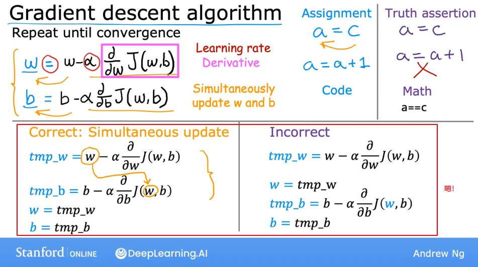

## 线性回归
### 基本概念和术语
线性回归模型是一种特殊类型的监督学习模型。

房价估计，x轴为房子大小，y轴为房价，根据数据集拟合出一条直线，用于根据房子大小预测房价。

术语(Terminology):
1. $x$ = input variable(feature/input feature)
2. $y$ = output(target) variable
3. $m$ = 训练样本数量
4. ($x$, $y$) = 一个训练样本
5. ($x^{(i)}$, $y^{(i)}$) = 第i个训练样本
6. 训练集
7. $f$ = model，通过训练得到的函数，用于预测，输入x，输出$\hat y$
8. $\hat y$ = 预测值，是个估计值，$y$是目标值。
9. $\hat y^{(i)}=f_{w,b}(x^{(i)})=wx^{(i)}+b$，一元线性回归

### 代价函数
代价函数用于找的w和b，使得对于训练集的所有($x^{(i)}$, $y^{(i)}$)都让$\hat y^{(i)}$接近$y^{(i)}$。

误差：$(\hat y^{(i)}-y^{(i)})^2$

整个训练集的误差：$\sum_{i=0}^m(\hat y^{(i)}-y^{(i)})^2$

均方误差：$\frac{1}{m}\sum_{i=0}^m(\hat y^{(i)}-y^{(i)})^2$

代价函数：$J(w,b)=\frac{1}{2m}\sum_{i=0}^m(\hat y^{(i)}-y^{(i)})^2$，均方误差再除2是为了让后续计算简单。称为方差代价函数。

**目标**就是要最小化$J(w,b)$。

### 多元线性回归
到了多元，指的就是某个样本具有多个特征，比如之前的房价预测仅有一个房子大小，现在又加了一些特征（房间数量、楼层和房龄等）。

术语（Terminology）：
1. $x_j$表示第几个特征。
2. $n$表示特征的总数。
3. $\vec{x^{(i)}}$表示第i个训练样本，是个向量，向量中每个元素是特征。
4. $x^{(i)}_j$表示第i个训练样本的第j个特征值。

### 特征工程
利用一些经验设计一些新的特征，通常是对原始特征进行变换或者结合操作。增加的这些新特征，可以使预测变得更准确。如图。
  

### 多项式回归
Polynomial regression，结合特征工程，对特征进行幂次运算，形成多项式，去拟合。

## 梯度下降
梯度：方向导数的最大值，就是某个方向数值变化最大的向量。下降：变小。

具体可以见下面这个例子，来自于吴恩达课程。

解释一下。一个人站在山上，要去往最低的山谷。这时，这个人要旋转360度，找到一个距离他站的位置**坡度最陡**的一个目标点，然后迈出**一步**。重复上述过程，知道走到山谷，当然，这个山谷可能是一个局部最低点。

### 梯度下降算法
需要重复下图两个更新w和b的步骤直到w和b收敛。
  

**一步**的**长度**就是算法中的学习率，用$α$表示。一般来说$α$是一个0到1之间的数，取0.01, 0.001等。

### 学习率
如果学习率很小的话，那么我们的步子就会很小，这就使代价函数$J(w,b)$的两个参数减小的非常慢，进而导致了最小化代价函数这个过程所用的时间变得很长。

如果学习率很大的话，那么有一种可能会跨过最低点，如图粉色的点。
  

选择合适的学习率。就是不断尝试，从一个很小的数，比如0.001，然后看loss是否不断下降，如果下降过慢，再逐渐将学习率增大。

### 线性回归的梯度下降
由于均方误差损失函数是个凸函数，所以只有一个全局最小值。
  

### 特征放缩
当有不同的特征，并且不同特征的取值范围相差比较大时，可能会导致梯度下降运行缓慢，可以适当对这些特征进行缩放，可以有效加快梯度下降的速度。这是一个小技巧。

#### 如何做
1. 将每个特征都除以自己的最大值，如图。
  
2. mean normalization，每个特征减去自己的均值，再除以最大值和最小值的差，如图。
  
3. Z-score normalization，每个特征减去自己的均值，再除以标准差，如图。
  

### 检查梯度下降是否收敛
两种方法，一个是根据loss的值和迭代次数画出代价下降曲线，另一个是“自动收敛检测”，如下图。吴恩达喜欢第一种方法。
  
