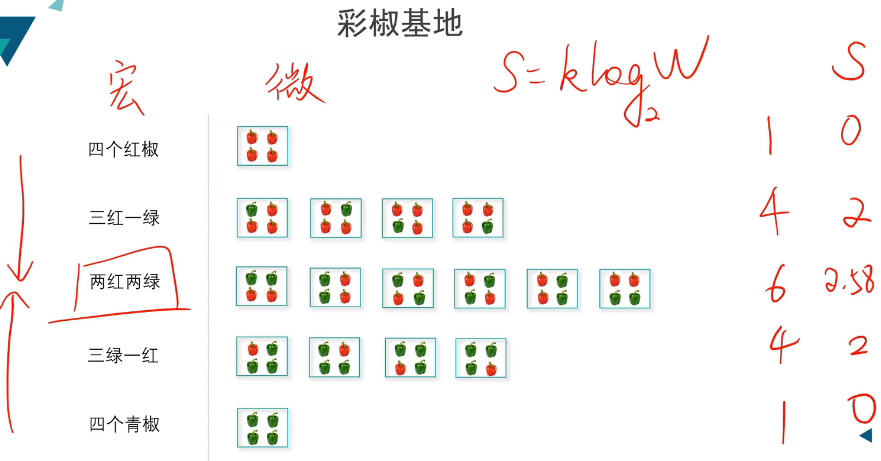

### 信息熵(Information Entropy)
熵(entropy)是热力学中的概念，由香浓引入到信息论中。在信息论和概率统计中，熵用来表示随机变量不确定性的度量。

在热力学中，熵是指**度量系统内在的混乱程度**。其中，**系统**在**宏观态**，**内在的混乱程度**在**微观态**。

**玻尔兹曼**给出了熵的计算公式：$S=k\log W$。其中，$S$是熵，$k$是玻尔兹曼常数，$W$是微观状态的总数。

> 举例
> 共4个菜椒，有红有绿，讨论彩椒的摆放。宏观态是几个红椒，几个青椒；微观态是摆放方式。$k$是常数不考虑，$W$的取值是摆放方式数量。发现，当宏观态为两红两绿时，熵最大。
>   

在统计学和机器学习中，用到的熵被称为**信息熵**。在物理学中的熵对应的系统是**物质系统**；在信息学中，对应的就是**信息系统**。

**信息**：用以消除随机不确定性。比如：当你获取到今天的夜间是繁星满空这个信息时，那么第二天晴天的概率是比较大的。

**信息如何获取？**信息是由**数据**中获取，数据由**声音、图像**和**符号、文字**组成。一般来讲，数据是具有噪声的，所以，数据是**信息**和**噪声**的混合体。

#### 信息量
> 假设有这样一个场景：抛硬币，并且需要将结果（正面为1，反面为0）传输给另一个人。那么可以设置1个bit来传输这个数据。

> 再假设另一个场景：扑克牌花色，四张不同花色K，随机抽取一张，将结果传输给另一个人。那么可以设置2个bit位来传输这个数据，分别是00、01、10、11。

> 最后一个场景：投骰子，6种可能，结果传输给另一个人。那么可以设置3个比特位，分别是000，001，010，100，011，101（其他两个110和111未使用到）。

综上所述，三个场景中所有**等概率事件的数量$N$取以2为底的对数**，正好是我们传递这个事件结果所需的**信号数量（信号长度）$L$**。即$L=\log_2 N$。这个**信号数量**就是**信息量**。

这种信息的度量方式刻画了一个事实，一个系统的“等可能”事件越多，那么传输其中一个事件的信息量也就越大，也就意味着**哪个事件发生的不确定性越大**，所以信息量也可以看作是对信号源不确定性的一个刻画。

#### 信息熵概念
刚才，我们系统中每个事件的发生都是**等概率**的，现在让我们来假设另外一种场景，如下。

> 假设一个场景：抛硬币，两面不是等可能性，正面概率为$p_1=0.8$，反面概率为$p_2=0.2$。根据刚才的公式$\log_2 N$，可以求出当前场景下的信息量。但是，现在只有事件发生的概率$p_i$，不知道$N_i$。我们可以用这个公式$N_i=\frac{1}{p_i}$计算出$N_i$。

综上，这个系统的**信息量**就可以这样计算，即$\log_2 \frac{1}{p_1} + \log_2 \frac{1}{p_2}$。

进一步地，式子中的两项信息出现的概率是不同的，我们在每一项的前面乘上它们出现的概率$p_i$，有$p_1 \log_2 \frac{1}{p_1} + p_2 \log_2 \frac{1}{p_2}$

最后，为了更具一般化，我们将一个系统中各个事件（设有n个）发生的概率设为$p_i(i=1,2,...,n)$，根据上述写法，即可写为$H = \sum p_i \log_2 \frac{1}{p_i}$，整理一下，即$H = - \sum p_i \log_2 p_i$。$H$就是香农提出的**信息熵**。

根据信息熵的公式$H = - \sum p_i \log_2 p_i$，我们可以看出，信息熵就是某个系统的各个事件信息量**均值**，就是**期望**。

> 再回到刚才的场景，最后计算得到的信息熵为$H = -\sum p_i\log_2p_i = -0.2*\log_20.2-0.8*\log_20.8≈0.72(bit)$，就是说，我们最少可以使用0.72bit就可以把数据传输出去，当然，在计算机中，需要1bit。

> 再回到刚才刚才的场景，抛硬币，等可能。最后计算得到的信息熵为$H = -\sum p_i\log_2p_i = -0.5*\log_20.5-0.5*\log_20.5 = 1(bit)$，由此可以看出，我们直接计算信息量（$信息量 = \log_22 = 1$）就可以得出信息熵。所以，这种等可能事件的系统是一个特例。

#### 参考资料
1. 《机器学习》-周志华
2. 《统计学习方法》-李航
3. https://www.bilibili.com/video/BV1av411s7QS
4. https://www.bilibili.com/video/BV1oX4y1w7aG
5. https://transwarpio.github.io/teaching_ml