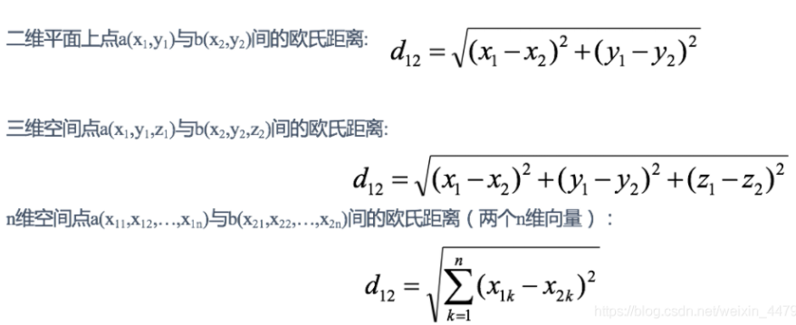
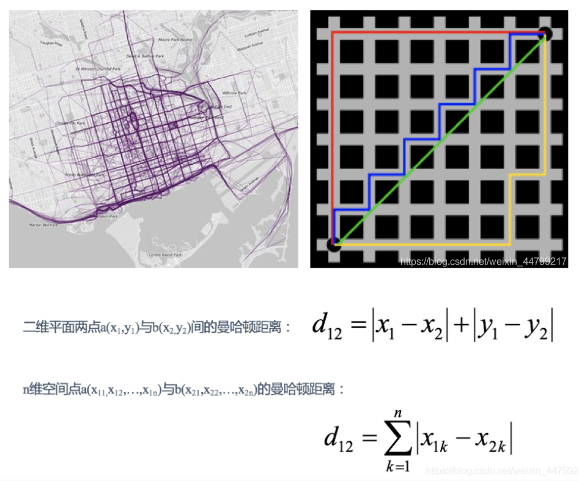
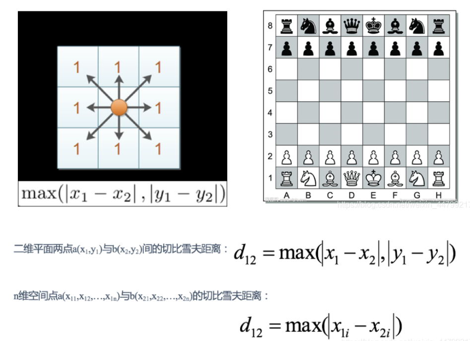

# 10.1 k近邻学习
三要素：距离度量，k值的选择，分类决策规则。

## 距离度量
### 闵可夫斯基距离
设特征空间$x$是$n$维实数向量空间 ，$x_{i}, x_{j} \in \mathcal{X}$,$x_{i}=\left(x_{i}^{(1)}, x_{i}^{(2)}, \cdots, x_{i}^{(n)}\right)^{\mathrm{T}}$,$x_{j}=\left(x_{j}^{(1)}, x_{j}^{(2)}, \cdots, x_{j}^{(n)}\right)^{\mathrm{T}}$
，则：$x_i$,$x_j$的$L_p$距离定义为:
$L_{p}\left(x_{i}, x_{j}\right)=\left(\sum_{i=1}^{n}\left|x_{i}^{(i)}-x_{j}^{(l)}\right|^{p}\right)^{\frac{1}{p}}$

- $p= 1$  曼哈顿距离
- $p= 2$  欧氏距离
- $p= \infty$   切比雪夫距离（当$p趋于\infty$时，根号中是无穷个平方项相加，所以只取无穷个平方项中最大的就行，“抓大头”）

### 欧氏距离 $p=0$
通过距离平方值进行计算，从二维平面，到三维空间，再到n维空间。下图来自csdn。
  

### 曼哈顿距离$p=1$
通过距离的绝对值进行计算，
> 在曼哈顿街区要从一个十字路口开车到另一个十字路口，驾驶距离显然不是两点间的直线距离。这个实际驾驶距离就是“曼哈顿距离”。曼哈顿距离也称为“城市街区距离”(City Block distance)。

见下图。
  

### 切比雪夫距离$p=\infty$
维度的最大值进行计算。
> 国际象棋中，国王可以直行、横行、斜行，所以国王走一步可以移动到相邻8个方格中的任意一个。国王从格子(x1,y1)走到格子(x2,y2)最少需要多少步？这个距离就叫切比雪夫距离。

见下图。
  

> 以上图片引用于https://blog.csdn.net/weixin_44799217/article/details/114380911

## kd树(k-dimentional tree)
> https://www.joinquant.com/view/community/detail/a98b7021e7391c62f6369207242700b2
> https://www.joinquant.com/view/community/detail/dd60bd4e89761b916fe36dc4d14bb272
> https://www.joinquant.com/view/community/detail/c2c41c79657cebf8cd871b44ce4f5d97