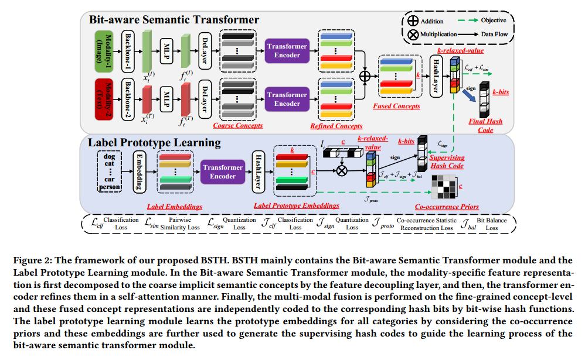
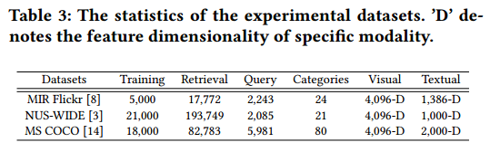
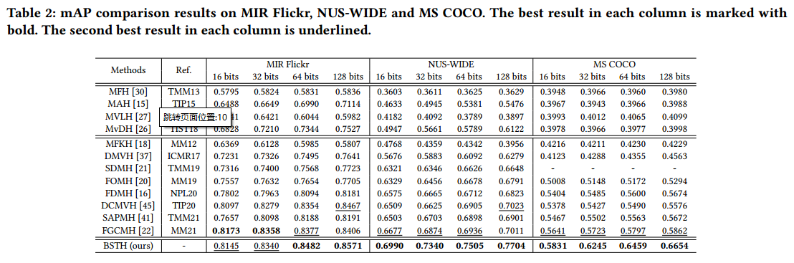
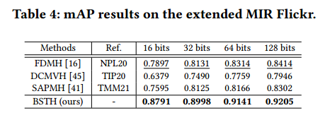
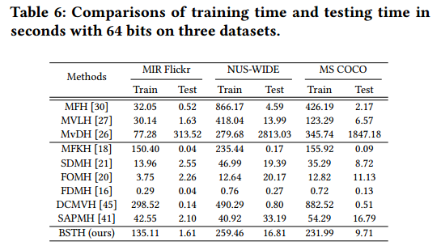
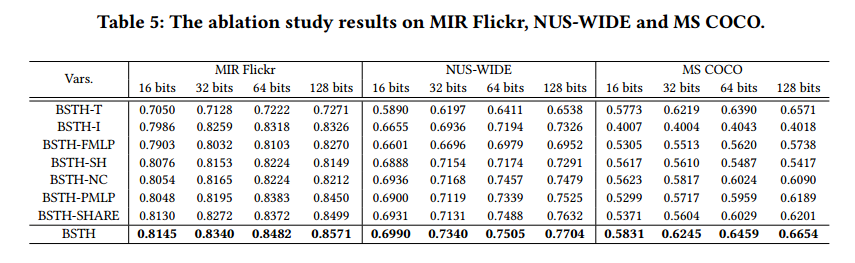
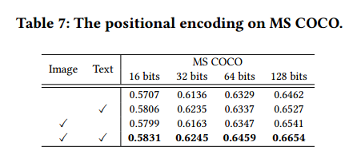
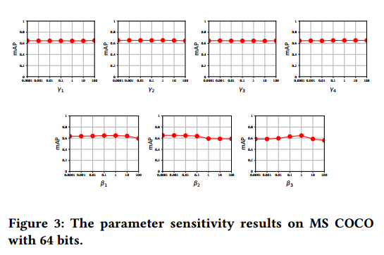

# 读相关论文
## Bit-aware Semantic Transformer Hashing for Multi-modal Retrieval
多模态检索使用**二进制哈希码**。现有方法存在三个问题：1）浅层学习的语义表达能力有限；2）强制性的特征级多模态融合忽略了不同模态语义的差距；3）直接粗糙的成对语义保留不能有效地捕获细粒度的语义关联。

### 模型框架
模型Bit-aware Semantic Transformer Hashing (BSTH)共分为3个部分：1）Bit-aware Semantic Transformer；2）Label Prototype Learning；3）Objective Function。
  

#### 符号定义
- 定义$\mid\mid\cdot\mid\mid_2$为**L2-norm**，定义$\mid\mid\cdot\mid\mid_F$为**Frobenius norm**。
- 定义训练集为$\mathbf{O}_{tr}=\{\mathbf{o}_i\}_{i=1}^n$，训练集由$n$个图像和文本模态的样本组成。
- 利用**特定模态特征提取器**，提取出**原始图像数据和文本数据**，分别定义为$\mathbf{X}^{(I)}=[\pmb{x}_1^{(I)},\pmb{x}_2^{(I)},...,\pmb{x}_n^{(I)}] \in \mathbb{R}^{n\times d^{(I)}}$和$\mathbf{X}^{(T)}=[\pmb{x}_1^{(T)},\pmb{x}_2^{(T)},...,\pmb{x}_n^{(T)}] \in \mathbb{R}^{n\times d^{(T)}}$，其中，$d^{(I)}$和$d^{(T)}$表示图像特征和文本特征表示的**维度**。
- 定义训练集的标签矩阵为$\mathbf{L}=[\pmb{l}_1,\pmb{l}_2,...,\pmb{l}_n]\in\{0,1\}^{n\times c}$，其中$l_{ij}\in\{0,1\}$表示属于第$j$个类别的第$i$个样本的标签，$c$表示类别的数量。
- 定义$\mathbf{B}=[\pmb{b}_1,\pmb{b}_2,...,\pmb{b}_n]\in\{-1,1\}^{n\times k}$为$k$位**哈希码矩阵**。

#### Bit-aware Semantic Transformer
##### 首先，MLP
将**已提取的特定模态特征表示**$\pmb{x}_i^{(*)}$通过**多层感知机**$\pmb{MLP^{(*)}}(·;\theta_{mlp}^{(*)})$映射到**相同维度特征表示**$\pmb{f}_i^{(*)}$。如**公式(1)**$\pmb{f}_i^{(*)}=\pmb{MLP^{(*)}}(\pmb{x}_i^{(*)};\theta_{mlp}^{(*)}),s.t.*\in\{I,T\}$，其中$\theta_{mlp}^{(*)}$是可训练的参数。

``` python
# class MLP in layers.py
# use MLP in model_transformer.py
# definition
self.imageMLP = MLP(hidden_dim=self.img_hidden_dim, act=nn.Tanh())
self.textMLP = MLP(hidden_dim=self.txt_hidden_dim, act=nn.Tanh())
# train forward
imageH = self.imageMLP(image) # 公式(1)
textH = self.textMLP(text) # 公式(1)
```

##### 然后，DeLayer
定义**特征解耦层**$\pmb{DeLayer^{(*)}}(·;\theta_{de}^{(*)})$，用于分解$\pmb{f}_i^{(*)}\in\mathbb{R}^{1\times d_c}$为序列$\mathbf{C}_i^{(*)}$，序列中包含$k$个**粗隐式语义概念表示**。如**公式(2)**$\mathbf{C}_i^{(*)}=[\pmb{c}_{i1}^{(*)},\pmb{c}_{i2}^{(*)},...,\pmb{c}_{ik}^{(*)}]=\pmb{DeLayer^{(*)}}(\pmb{f}_i^{(*)};\theta_{de}^{(*)})$，其中$\pmb{c}_{ik}^{(*)}\in\mathbb{R}^{1\times d_c}$为第$i$个**特定模态样本**的第$k$个**粗隐式语义概念表示**，$d_c$表示某**概念表示**的**维度**，$\theta_{de}^{(*)}$为可训练参数。

具体来说，先利用**线性投影层**将$\pmb{f}_i^{(*)}$映射为$\widetilde{\pmb{f}}_i^{(*)}\in\mathbb{R}^{1\times(k\times d_c)}$，再用**重塑操作**将$\widetilde{\pmb{f}}_i^{(*)}$转为$\mathbf{C}_i^{(*)}\in\mathbb{R}^{k\times d_c}$。

```python
# class Linear in pytorch
# use both in model_transformer.py
# def
self.imageConcept = nn.Linear(self.common_dim, self.common_dim * self.nbit)
self.textConcept = nn.Linear(self.common_dim, self.common_dim * self.nbit)
# train forward
imageC = self.imageConcept(imageH).reshape(imageH.size(0), self.nbit, self.common_dim).permute(1, 0, 2) # (nbit, bs, dim) 公式(2)的第一步线性投影+第二步重塑操作
textC = self.textConcept(textH).reshape(textH.size(0), self.nbit, self.common_dim).permute(1, 0, 2) # (nbit, bs, dim) 公式(2)的第一步线性投影+第二步重塑操作
```

##### 进一步，TransformerEncoder
引入`Modality-specific Transformer Encoder`，用于以`self-attention`方式捕获这$k$个**粗粒度隐式语义概念**之间的**潜在相关性**。如**公式(3)**$\mathbf{\widetilde{C}}_i^{(*)}=\pmb{TransformerEncoder^{(*)}}(\mathbf{C}_i^{(*)};\theta_{enc}^{(*)})$，其中，$\mathbf{\widetilde{C}}_i^{(*)}\in\mathbb{R}^{k\times d_c}$定义为第$i$个样本的**细粒度的语义概念序列**，$\theta_{enc}^{(*)}$为可训练的参数。

具体来说，`TransformerEncoder`包含三个子模型：`positional
encoding submodule`，`multi-head self-attention submodule` and `feed-forward network`。三个子模型的细节参考论文[Attention Is All You Need](https://doi.org/10.48550/arXiv.1706.03762)。

```python
# class PositionalEncoding in layers.py and class TransformerEncoderLayer in transformer.py
# use both in model_transformer.py
# def
self.imagePosEncoder = PositionalEncoding(d_model=self.common_dim, dropout=self.dropout)
self.textPosEncoder = PositionalEncoding(d_model=self.common_dim, dropout=self.dropout)

imageEncoderLayer = TransformerEncoderLayer(d_model=self.common_dim,
                                            nhead=self.nhead,
                                            dim_feedforward=self.common_dim,
                                            activation=self.act,
                                            dropout=self.dropout)
imageEncoderNorm = nn.LayerNorm(normalized_shape=self.common_dim)
self.imageTransformerEncoder = TransformerEncoder(encoder_layer=imageEncoderLayer, num_layers=self.num_layer, norm=imageEncoderNorm)
textEncoderLayer = TransformerEncoderLayer(d_model=self.common_dim,
                                           nhead=self.nhead,
                                           dim_feedforward=self.common_dim,
                                           activation=self.act,
                                           dropout=self.dropout)
textEncoderNorm = nn.LayerNorm(normalized_shape=self.common_dim)
self.textTransformerEncoder = TransformerEncoder(encoder_layer=textEncoderLayer, num_layers=self.num_layer, norm=textEncoderNorm)
# train forward
imageSrc = self.imagePosEncoder(imageC) # 公式(3)的第一步
textSrc = self.textPosEncoder(textC) # 公式(3)的第一步
imageMemory = self.imageTransformerEncoder(imageSrc) # 公式(3)的二三步
textMemory = self.textTransformerEncoder(textSrc) # 公式(3)的二三步
```

##### 然后，Fusion
进行多模态融合。如**公式(4)**$\mathbf{\widetilde{C}}_i^{f}=[\pmb{\widetilde{c}}_{i1}^{f},\pmb{\widetilde{c}}_{i2}^{f},...,\pmb{\widetilde{c}}_{ik}^{f}]=\sum\limits_{*\in\{I,T\}}\mathbf{\widetilde{C}}_i^{(*)},\mathbf{\widetilde{C}}_i^{f}\in\mathbb{R}^{k\times d_c}$，其中，$\mathbf{\widetilde{C}}_i^{f}$为第$i$个样本的**已融合的隐式语义概念序列**。

```python
# train forward in model_transformer.py
memory = imageMemory + textMemory # 公式(4)多模态融合
```

##### 最后，Bit-wise Hash Function
采用`bit-wise hash functions`对已融合的隐式语义概念表示编码为**相应的哈希位**。如**公式(6)**$\pmb{h}_i=\pmb{Concat}(\mathcal{H}_1(\pmb{\widetilde{c}}_{i1}^{f};\theta_{h1}),\mathcal{H}_2(\pmb{\widetilde{c}}_{i2}^{f};\theta_{h2}),...,\mathcal{H}_k(\pmb{\widetilde{c}}_{ik}^{f};\theta_{hk}))$和**公式(7)**$\pmb{b}_i=sign(\pmb{h}_i),\pmb{h}_i\in\mathbb{R}^{1\times k},\pmb{b}_i\in\{-1,1\}^{1\times k}$，其中，$\theta_{hk}$为可训练的参数，$\mathcal{H}_1(·;\theta_{h1})$为与第$k$个哈希位相关的`bit-wise hash function`。

```python
# in model_tansformer.py
# def
self.hash = nn.Sequential(
            nn.Conv2d(in_channels=self.nbit * self.common_dim, out_channels=self.nbit * self.common_dim // 2, kernel_size=1, groups=self.nbit),
            nn.BatchNorm2d(self.nbit * self.common_dim // 2),
            nn.Tanh(),
            nn.Conv2d(in_channels=self.nbit * self.common_dim // 2, out_channels=self.nbit, kernel_size=1, groups=self.nbit),
            nn.Tanh()
)
# train forward
code = self.hash(memory.permute(1, 0, 2).reshape(self.batch_size, self.nbit * self.common_dim, 1, 1)).squeeze() # 公式(6)
```

##### 另外，Predict The Pseudo Labels
为了保留语义信息，基于上文的**哈希码**$\pmb{h}_i$使用**全连接层**加**激活函数**预测**伪标签**$\widetilde{\pmb{l}}_i$。如**公式(8)**$\widetilde{\pmb{l}}_i=sigmoid(\pmb{FC}(\pmb{h}_i;\theta_{fc}))$，其中，$\pmb{FC}(·;\theta_{fc})$为**全连接层**，$\theta_{fc}$为可训练的参数。

```python
# in model_tansformer.py
# def
self.classify = nn.Linear(self.nbit, self.classes)
# train forward
self.classify(code) # 公式(8)
```

#### Label Prototype Learning
##### 首先，Embedding
将所有类别投影到`feature embeddings`。如**公式(9)**$\mathbf{E}^{\pmb{L}}=\pmb{Embedding}(\mathcal{S}^{\pmb{L}};\theta_{el}),\mathbf{E}^{\pmb{L}}\in\mathbb{R}^{c\times k}$，其中，$\mathcal{S}^{\pmb{L}}$为类别序列（例如["dog","cat","person",...]），$\theta_{el}$为可训练参数。

```python
# in model_transformer.py
# def
self.labelEmbedding = nn.Embedding(self.classes + 1, self.d_model, padding_idx=0) # [N, S=args.classes, D=args.nbit]
# train forward
label_embedding = self.labelEmbedding(index) # 公式(9) (N=1, C, K) without padding index
```

##### 然后，TransformerEncoder
为了学习`label prototype embeddings`，保留**不同类别**间的**显式语义关联**，引入`transformer encoder`。如**公式(10,11)**$\mathbf{\widetilde{E}}^{\pmb{L}}=[\pmb{\widetilde{e}}_{1}^{\pmb{L}},\pmb{\widetilde{e}}_{2}^{\pmb{L}},...,\pmb{\widetilde{e}}_{c}^{\pmb{L}}]=\pmb{TransformerEncoder^{(\pmb{L})}}(\mathbf{E}^{\pmb{L}};\theta_{enc}^{\pmb{L}}),\mathbf{\widetilde{E}}^{\pmb{L}}\in\mathbb{R}^{c\times k}$，其中，$\theta_{enc}^{\pmb{L}}$为可训练参数。

``` python
# in model_transformer.py
# def
# [S, N, D]
labelEncoderLayer = nn.TransformerEncoderLayer(d_model=self.d_model,
                                               nhead=self.nhead,
                                               dim_feedforward=self.d_model,
                                               activation='gelu',
                                               dropout=0.5)
labelEncoderNorm = nn.LayerNorm(normalized_shape=self.d_model)
self.labelTransformerEncoder = TransformerEncoder(encoder_layer=labelEncoderLayer, num_layers=self.num_layer, norm=labelEncoderNorm)
# train forward
memory = self.labelTransformerEncoder(label_embedding.permute(1, 0, 2)) # 公式(10,11) (C, 1, K)
```

##### 进一步，Learn The Label Prototype Embeddings
通过`category-wise hash function`学习最终的`label prototype embeddings`。如**公式(12)**$\mathbf{P}^{\pmb{L}}=[\pmb{p}_1^{\pmb{L}},\pmb{p}_2^{\pmb{L}},...,\pmb{p}_c^{\pmb{L}}]=[\mathcal{H}_1^p(\pmb{\widetilde{e}}_{1}^{\pmb{L}};\theta_{h1}^p),\mathcal{H}_2^p(\pmb{\widetilde{e}}_{2}^{\pmb{L}};\theta_{h2}^p),...,\mathcal{H}_c^p(\pmb{\widetilde{e}}_{c}^{\pmb{L}};\theta_{hc}^p)]$，其中，$\mathbf{P}^{\pmb{L}}\in\mathbb{R}^{c\times k}$定义为所有的`label prototype embeddings`，$\theta_{hc}^p$为可训练参数。

``` python
# in model_transformer.py
# def
self.hash = nn.Sequential(
            nn.Conv2d(in_channels=self.classes * self.nbit, out_channels=self.classes * self.nbit, kernel_size=1, groups=self.classes),
            nn.Tanh()
)
# train forward
prototype = self.hash(memory.permute(1, 0, 2).reshape(1, self.classes * self.nbit, 1, 1)).squeeze()
prototype = prototype.squeeze().reshape(self.classes, self.nbit)
```

##### 然后，Generate The Supervising Hash Code
为了防止`sign(·)`操作带来的量化误差，采用了`relaxed label prototype embeddings`。在学习了`label prototype embeddings`$\mathbf{P}^{L}$之后，使用标签向量$\pmb{l}_i$通过与$\mathbf{P}^{L}$线性组合生成**监督哈希码**。如**公式(13)**$\pmb{h}_i^L=\pmb{l}_i\mathbf{P}^L,\pmb{h}_i^L\in\mathbb{R}^{1\times k}$和**公式(14)**$\pmb{b}_i^L=sign(\pmb{h}_i^L),\pmb{b}_i^L\in\{-1,1\}^{1\times k}$。

``` python
# in model_transformer.py
# train forward
code = torch.matmul(label, prototype) # 公式(13)
```

##### 最后，Predict The Pseudo Labels
类似**公式(8)**预测**伪标签**。如**公式(15)**$\widetilde{\pmb{l}}_i^L=sigmoid(\pmb{FC}^{(L)}(\pmb{h}_i^L;\theta_{fc}^L))$。

``` python
# in model_transformer.py
# def
self.classify = nn.Linear(self.nbit, self.classes)
# train forward
pred = self.classify(code) # 公式(15)，缺个激活函数
```

#### 目标函数
对两个过程（`Bit-aware Semantic Transformer`和`Label Prototype Learning`）分别定义了不同的**损失函数**。

##### Bit-aware Semantic Transformer
1. 分类损失$\mathcal{L}_{clf}$，用于将已标注语义信息保存到**已预测的伪标签**中。如**公式(16)**$\mathcal{L}_{clf}=||\widetilde{\pmb{l}}_i-\pmb{l}_i||_2^2$。
2. 量化损失$\mathcal{L}_{sign}$，用于最小化`sign(·)`操作的量化误差。如**公式(17)**$\mathcal{L}_{sign}=||\pmb{h}_i-\pmb{b}_i^L||_2^2$。
3. 相似度损失$\mathcal{L}_{sim}$，用于保持样本间的两两相关性。如**公式(18)**$\mathcal{L}_{sim}=||cos(\pmb{h}_i,\pmb{h}_j)-\mathbf{S}_{ij}||_2^2$，其中$\mathbf{S}$是相似度矩阵，其建模了相关样本之间细粒度的关联，可以表示为**公式(19)**$\mathbf{S}_{ij}=\frac{2}{1+e^{-\pmb{l}_i\pmb{l}_j^T}}-1,\mathbf{S}_{ij}\in[0,\frac{2}{1+e^{-c}}-1]$。
4. 最后，得到此学习阶段(`Bit-aware Semantic Transformer`)的目标函数为**公式(20)**$\min\limits_{\Theta_{BaT}}\mathcal{L}=\beta_1\mathcal{L}_{clf}+\beta_2\mathcal{L}_{sign}+\beta_3\mathcal{L}_{sim}$，其中，$\beta_1,\beta_2,\beta_3$是`trade-off hyper-parameters`，$\Theta_{BaT}$表示该模块(`Bit-aware Semantic Transformer`)中所有可训练的参数。

##### Label Prototype Learning
1. 分类损失$\mathcal{L}_{clf}$，与公式(16)类似，利用**标签信息**指导`label prototype learning module`的训练过程。如**公式(21)**$\mathcal{J}_{clf}=||\widetilde{\pmb{l}}_i^L-\pmb{l}_i||_2^2$。
2. 量化损失$\mathcal{J}_{sign}$。如**公式(22)**$\mathcal{J}_{sign}=||\pmb{h}_i^L-\pmb{b}_i^L||_2^2$。
3. `co-occurrence statistic reconstruction loss`$\mathcal{J}_{proto}$，考虑`co-occurrence prior`用于保留不同类别间的显示语义关联到`label prototype embeddings`中。如**公式(23)**$\mathcal{J}_{proto}=||cos(\mathbf{P}^L,{(\mathbf{P}^L)}^T)-\widetilde{\mathcal{R}}||_F^2$，其中，$\widetilde{\mathcal{R}}\in\mathbb{R}^{c\times c}$定义为`归一化的co-occurrence statistic matrix`，$\widetilde{\mathcal{R}}_{ij}$表示为训练集的第i个和第j个类别的`co-occurrence frequency`。
4. `bit balance loss`$\mathcal{J}_{bal}$，用于最大化**哈希码**的**信息熵**。如**公式(24)**$\mathcal{J}_{bal}=||\pmb{h}_i^L\vec{1}||_2^2$，其中，$\vec1$是元素全为$1$的列向量。
5. 最终，`label prototype learning module`的目标函数为**公式(25)**$\min\limits_{\Theta_{LPL}}\mathcal{J}=\gamma_1\mathcal{J}_{clf}+\gamma_2\mathcal{J}_{sign}+\gamma_3\mathcal{J}_{proto}+\gamma_4\mathcal{J}_{bal}$，其中，$\gamma_1,\gamma_2,\gamma_3,\gamma_4$为`trade-off hyper-parameters`，$\Theta_{LPL}$为本阶段（`label prototype learning module`）所有可训练的参数。

#### Optimization and Out-of-Sample Extension
> We **first** optimize the label prototype learning module and generate the supervising hash codes for all the training samples. **Then**, we use these supervising hash codes to guide the learning process of the bit-aware semantic transformer module. 
> When **a new multimodal query** arrives, we can generate the corresponding hash code by the bit-aware semantic transformer module.

### 实验
#### 数据集
使用三个数据集：MIR Flickr，NUS-WIDE和MS COCO。包含图像数据和文字数据。使用**VGGNet**提取图像特征表示，使用**Bag-of-Words(BoW)向量**作为文字特征表示。三个数据集的统计信息如下图。
  

#### 评价指标和Baselines
评价指标采用平均精度（the mean Average Precision, mAP），用于量化评价哈希性能，其值越高，说明性能越好。

对比方法都是多模态哈希方法，有12个。分为无监督方法（MFH，MAH，MVLH，MvDH）和有监督方法（MFKH，DMVH，SDMH，FOMH，FDMH，DCMVH，SAPMH，FGCMH）。

#### 结果与比较
  
  
  

#### 消融实验
  
  

#### Parameter Sensitivity
  

### 结论
> In this paper, we propose a Bit-aware Semantic Transformer Hashing (BSTH) framework to excavate bit-wise semantic concepts and simultaneously align the heterogeneous modalities for multi-modal hash learning on the concept-level. We design bit-wise hash functions to encode the implicit semantic concepts to the corresponding hash bits. To supervise the bit-aware transformer module, we develop a label prototype learning module to learn prototype embeddings for all categories that capture the explicit semantic correlations on the category-level by considering the co-occurrence priors. This module generates the supervising hash codes for guiding the bit-aware semantic transformer module. Experiments on three widely tested multi-modal retrieval datasets demonstrate the superiority of the proposed method from various aspects.