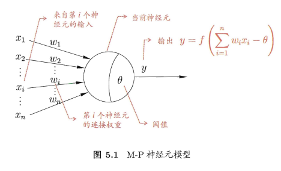
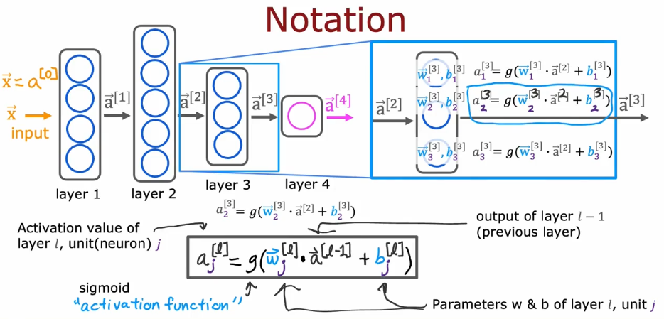
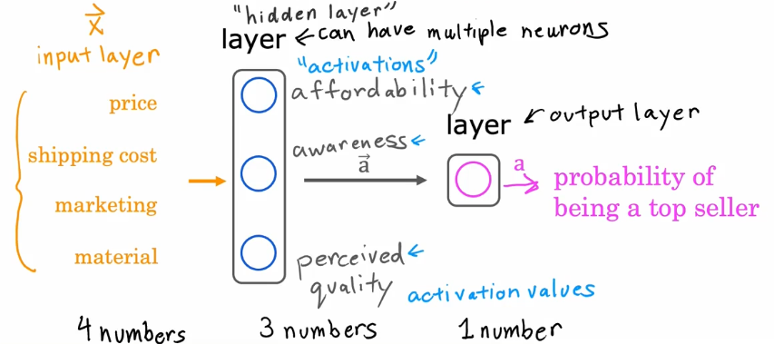
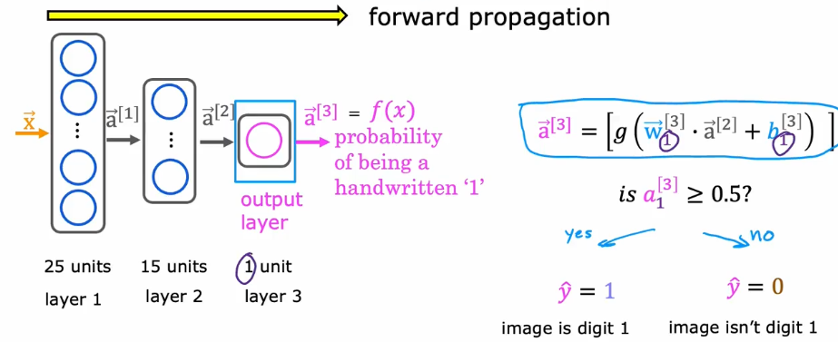

# 感知机与多层网络

# 人工神经网络
`人工神经网络`模仿了生物中的`神经网络`。`神经网络`由神经元组成，每个神经元都由细胞体、轴突和树突组成；`人工神经网络`也同样，每个神经元由计算单元、输入和输出组成。
  
  

## 一些术语
1. **layer**，层，可以包含多个神经元。
2. **input layer**，输入层，通常用于训练特征的输入，将输入的特征传递给神经网络。
3. **output layer**，输出层，一般有一个神经元，用于将神经网络的计算结果输出。
4. **hidden layer**，隐藏层，通常指构建的神经网络架构，可以有多层，每一层可以有多个神经元。
5. **activation function**，激活函数，用于模拟真的神经元的阈值，电信号超过一定阈值后将发生“激活”操作，使神经元将电信号向下传递，常用的有Sigmoid Function等。
6. **feature vector**，特征向量。

此外，还有一些符号的定义。
  

## 举例
T恤的需求预测，根据4个数字（价格、运输成本、营销和面料）来预测某件T恤是否能热卖（预测1个数字，即热卖的概率）。但是4个数字只是某件T恤客观存在的信息，这3个数字（承受能力、认知和质量）才是真正影响热卖概率的关键。而3个数字是受4个数字的影响的：承受能力受价格和运输成本影响，认知受营销手段影响，质量受价格和面料影响。所以，我们设置三个神经元，组成一个组，为**隐藏层**，用于计算上述影响程度；设置一个神经元，组成**输出层**，计算热卖的概率；4个数字组成特征向量，作为**输入层**。如下图所示。
  

根据这个例子，额外需要说明一下输入层的形状问题：如果按照上述影响情况（4个数字对那三个数字的影响），输入层的特征向量的形状是不同的，也就是说特征向量输入到三个神经元的形状是不同的（第一个神经元需要的特征向量的长度为2，第二个需要1，第三个需要2），这就带来了架构设计的问题。为了解决上述问题，我们统一输入层特征向量的形状，即对于隐藏层的所有神经元的输入形状都一致，若某个神经元不需要某个特征，只需要设置其参数为0即可。

## 前向传播
forward propagation，从左到右向前计算，用于做预测。
  
