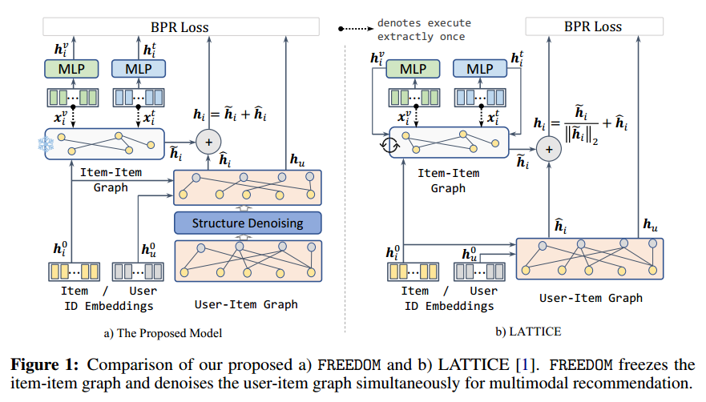
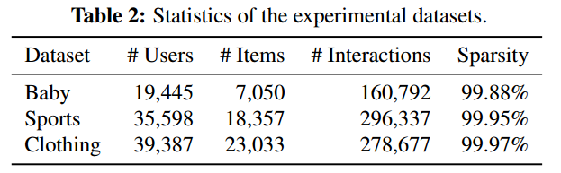
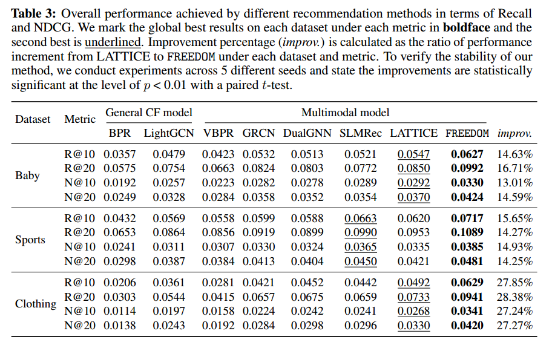
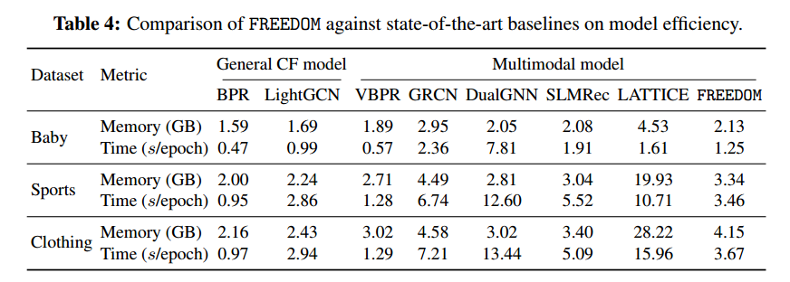
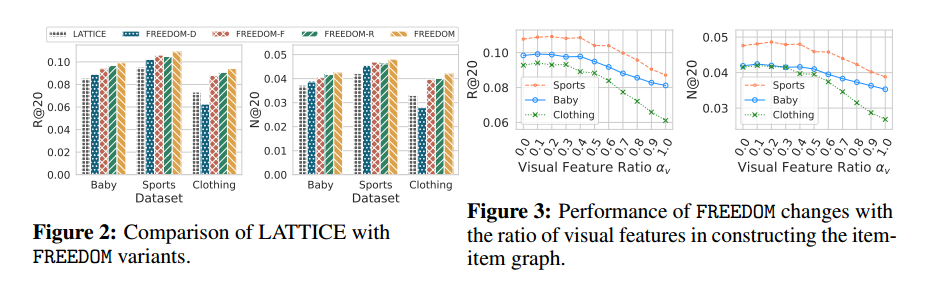
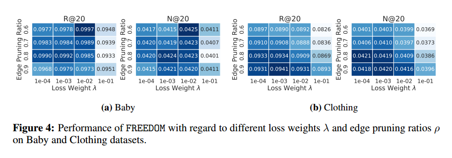
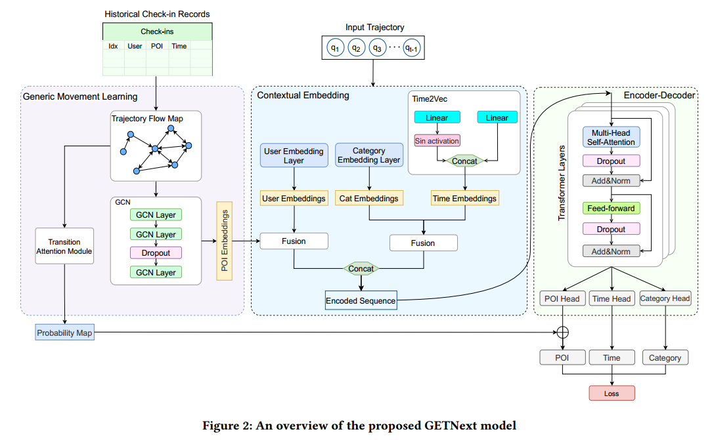
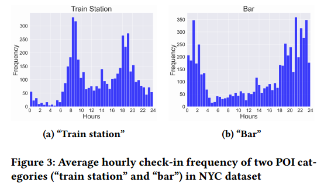

# 读相关论文
## NCF(Neural Collaborative Filtering)
**协同过滤**，基于用户过去与商品的互动（比如评价、点击等）来对商品的偏好进行建模。

对于协同过滤，有很多不同的技术，比如矩阵分解（MF）。

**矩阵分解**，将用户和商品投影到共享的潜在空间中，使用潜在的特征向量来表示用户或物品。所以，用户在一个物品上的交互（评价、点击等）就被建模为它们潜在向量的内积。缺点：这种内积可能不足以捕获用户交互数据的复杂结构。

这篇文章探索使用DNNs来从数据中学习交互函数，相比较MF方法，使用DNNs进行推荐所做的工作将更少。

他们关注的是**隐式反馈**，就是那种能间接反映用户偏好的行为（比如观看视频、购买商品、点击物品等）。因为相比**显示反馈**（评价、评级等），**隐式反馈**可以自动追踪，对于内容提供者来说较容易收集。但是，这种方式因为没有观察到用户的满意度，所以**负面反馈**是稀缺的。

所以他们在这个文章中也探讨了利用DNNs来建模**噪声隐式反馈信号**这个中心主题。

并且他们的主要工作如下：


### 2. 准备工作
#### 2.1 从隐式数据中学习
假设有$M$个用户，$N$个商品。然后定义用户商品交互矩阵$Y$（吴恩达课程中讲的二进制标签）。
>   

这里有个问题：如果$y_{ui}=1$，不能说明用户$u$喜欢商品$i$；同理，如果$y_{ui}=0$，也不能说明不喜欢，可能只是用户不知道。所以，矩阵$Y$只提供了关于用户偏好的嘈杂信号。

隐式反馈的推荐问题表述为估计$Y$中未观察条目的分数问题，这些分数用于对条目进行排序。

$\hat y_{ui} = f(u,i|Θ)$，$\hat y_{ui}$表示交互$y_{ui}$预测的分数，$Θ$表示模型参数，$f$表示模型参数到预测分数的映射函数，

为了估计参数$Θ$，现有的方法通常遵循优化目标函数的机器学习范式。文献中常用的目标函数有两种，分别是**点损失**和**成对损失**。

**点损失**，**点学习**，通常遵循回归框架，最小化$\hat y_{ui}$与目标值$y_{ui}$之间的平方损失。对于未观察条目，一种是将其直接视为负反馈，第二种是从未观察条目中采样负反馈实例。

**成对损失**，**成对学习**，最大化观察到的条目$\hat y_{ui}$与未观察到的条目$\hat y_{ui}$之间的余量。观察条目排名应高于未观察条目。

对于**NCF**，使用神经网络将交互函数$f$参数化，来估计$\hat y_{ui}$。因此自然支持**点学习**和**成对学习**。

#### 2.2 MF(Matrix Factorization)矩阵分解
定义了两个潜在向量$\vec{p}_u$和$\vec{q}_i$，分别表示用户$u$和物品$i$。矩阵分解使用$\vec{p}_u$和$\vec{q}_i$的**内积**来估计交互值$y_{ui}$。
>  

其中，$K$表示潜在空间的**维度**。

由此可以看出，MF建模了用户和物品潜在因素的双向交互（<u>我的理解是因为内积，二者都影响最终结果</u>），并且假设潜在空间的各个维度之间相互独立（<u>各内积各的，不影响</u>）且权重相同（<u>每一项系数都是1</u>），然后线性组合（<u>每一项相加起来</u>）。所以，MF是潜在因素的线性模型。

使用下图做了举例，说明了内积函数是如何限制MF的表达性的。
>   

为了更好地理解这个例子，有两个设置要说明一下：
1. 由于MF将用户和物品映射到相同的潜在空间，所以判断两个用户的相似性也是可以用**内积**，或者另一种等价做法是利用两个用户的潜在向量的**夹角的余弦值**（当然，这里假设两个向量都是**单位向量**）。
2. 不失一般性，我们使用**Jaccard coefficient**作为MF需要恢复的两个用户的**真值相似度**。

> **Jaccard coefficient**
> 设$R_u$为用户$u$已经交互过的物品的集合（<u>就是那些$y_{ui}=1$的</u>），然后两个用户$i$和$j$的**Jaccard 相似性**就可以表示为$s_{ij}=\frac{\mid R_i\mid\bigcap\mid R_j\mid}{\mid R_i\mid\bigcup\mid R_j\mid}$，结果是个小数。

根据Figure 1a，可以得出$s_{23}=0.66>s_{12}=0.5>s_{13}=0.4$，故三个用户对应向量$\vec{p}_1 \vec{p}_2 \vec{p}_3$**必然**为Figure 1b的情况（<u>因为$s_{ij}$是相似性</u>）。

加入第四个用户$u_4$，我们可以得到相似性$s_{41}=0.6>s_{43}=0.4>s_{42}=0.2$，说明$u_4$与$u_1$最相似，但无论如何放置$\vec{p}_4$（在先保证与$\vec{p}_1$夹角余弦值最小的情况下）都是距离$\vec{p}_2$更近，而不是$\vec{p}_3$。

上述就是使用固定简单的内积的局限性，当然解决上述问题可以使用大量的$K$，但是又会不利于模型的泛化。所以下一小节将使用DNNs来解决这个限制。

### 3. NCF(NEURAL COLLABORATIVE FILTERING)
#### 3.1 总体框架
使用两个特征向量表示用户和物品，作为输入层，是稀疏的。然后上面一层是嵌入层，将输入层向量化，是全连接层。再往上是神经协同过滤层。最终输出层是预测分数，并通过最小化逐点损失来训练。
  

将NCF预测模型表述为下图：
  

由于NCF层是多层，故又表示成：
  

由于需要将输出的范围控制在$[0,1]$之间，所以激活函数使用了$sigmoid$。

然后，定义了似然函数：
  

并取似然函数的负对数，得到
  

这就是NCF要最小化的目标函数，它的优化可以通过随机梯度下降完成。（因为上文提到了平方损失与隐式数据不太吻合，所以就用了上面这种二值交叉熵loss）

#### 3.2 GMF(Generalized Matrix Factorization)
证明MF是NCF的一个特例。

**用户潜在向量**就是$P^T\vec v^U_u$，**物品潜在向量**就是$Q^T\vec v^I_i$，二者作为嵌入层。然后定义NCF层的第一层的映射函数为
  

$\odot$表示两个向量逐个元素乘积。

然后将这个结果向量投影到输出层，得到
  

$a_{out}$表示输出层激活函数，$\vec h$表示边权。

<u>理解：就是**用户**和**物品**两个向量作元素相乘，然后再与**边权向量**作点积，然后再加上**激活函数**，使结果维持在[0,1]。</u>

确实，如果**边权向量**的元素都为1，**激活函数**使之输出值不变，看起来就是**MF**。

综上，实现了一个广义矩阵分解，**激活函数**为$sigmoid$，向量$\vec h$使用**二值交叉熵损失**从数据中学习。

#### 3.3 MLP(Multi-Layer Perceptron)
用户和物品向量进行拼接，而不是对应元素相乘。激活函数使用$ReLU$。网络结构使用塔式，底层最宽，往上依次减半。

#### 3.4 Fusion of GMF and MLP
到此为止已经用NCF开发了两个实例，一个是运用线性核心对潜在特征交互建模的GMF，另一个是使用非线性从数据中学习交互函数的MLP。为了使二者相互增强，并且能为更复杂的用户交互建模，来融合二者。

一种最直接的方式是让GMF和MLP共享相同的嵌入层，然后再组合二者的交互函数作为输出。具体来说，GMF与单层MLP相结合的模型可以表示为
  

但是，这种方式会限制融合层模型的性能，比如二者需要使用相同大小的嵌入层，但二者的最优嵌入层可能不一样，所以灵活性不好。

为了更具灵活性，让二者使用不同的嵌入层，连接它们最后一个隐藏层来组合两个模型。图和公式如下
  

  

其中，$\vec p^G_u$和$\vec p^M_u$分别表示GMF和MLP的用户嵌入层，同理，$\vec q^G_i$和$\vec q^M_i$表示物品的。同上文，MLP层的激活函数使用$ReLU$。最后，称这个模型为"NeuMF(Neural Matrix Factorization)"。模型中关于每个参数的导数都可以通过反向传播计算。

##### 3.4.1 预训练
文献中推荐使用预训练，事先训练GMF和MLP的模型直到收敛，然后将二者的模型参数作为NeuMF的相应部分参数的初始化。唯一的调整是在输出层，将两个模型的参数作连接操作：
  

其中，$α$表示决定两个预训练模型之间权重的超参数（~~在代码中好像只做了连接操作，没有加入这个超参数~~。代码中$α$是0.5，在下文实验小节也提到了）。

对于训练GMF和MLP，采用了自适应矩估计，它通过对频繁的参数执行较小的更新和对不频繁的参数执行较大的更新来适应每个参数的学习率。在将预训练的参数输入NeuMF后，我们使用朴素SGD而不是Adam来优化它。（<u>但是，在代码中并没有见到使用SGD，通过对代码的debug，发现训练之前，优化器还是adam</u>）

### 4. EXPERIMENTS
实验的目的是为了解读下面三个问题：
1. 我们提出的NCF方法是否优于最先进的隐式协同过滤方法?
2. 我们提出的优化框架(负采样的对数损失)如何用于推荐任务?
3. 更深层次的隐藏单元是否有助于从用户项目交互数据中学习?

#### 4.1 实验设置
**数据集**选择了两个，分别是**MovieLens**和**Pinterest**。

**MovieLens**是一个显示反馈数据集，在本项目中，转为了隐式反馈数据集（即每个条目被标记为0或1）。

**评价协议**，文献中的评价方法采用留一法交叉验证，性能指标使用HR(Hit Ratio)和NDCG(Normalized Discounted Cumulative Gain)。

> <a href='https://zhuanlan.zhihu.com/p/493958358'>HR和NDCG的知乎文章</a>
> 
> **HR**，强调的是模型推荐的准确性，即用户的需求项是否包含在模型的推荐项中。
> **NDCG**，强调的是用户的需求项在模型推荐列表中的位置，越靠前越佳。

**Baselines**，选出4个模型与NCF的实例（GMF、MLP和NeuMF）比较。分别是：**ItemPop**、**ItemKNN**、**BPR**和**eALS**。

**参数设置**，损失函数均使用**log loss**，每个正实例均增加四个负实例，初始化模型参数使用**高斯分布**（均值为0，标准差为0.01），**batch_size**测试了[128, 256, 512, 1024]，**学习率**测试了[0.0001, 0.0005, 0.001, 0.005]，**预测因子**测试了[8, 16, 32, 64]，MLP的隐含层有3层。

文献剩下的内容都在讲图了就。

### 总结
通过这篇文章，我了解了推荐系统其中的一个方向：协同过滤。在这篇文献中，作者将神经网络与协同过滤相结合，提出了神经协同过滤框架，来处理基于隐式反馈的推荐。对比传统的方法(如MF和MF的推广等算法)，NCF(文中实现了三个实例，包括GMF、MLP和NeuMF)能够提供更好的推荐性能。

#### 1. 学习过程
##### 1.1 准备工作
文献阅读，下载知云，创建md笔记。

代码，克隆代码，创建conda环境，根据README.md调试运行环境。

##### 1.2 阅读论文
阅读论文方式，一句一句阅读，先自己翻译，再看知云翻译，见到专业名称就查找相关资料(文字或视频)学习，边读论文边做笔记。

##### 1.3 代码调试运行
阅读到该文献的第三节(3.2, 3.3, 3.4)，开始结合论文讲述的模型框架看具体代码实现，过程中不断利用debug查看一些变量的取值和方法的参数。

值得一提的是，在调试代码的过程中发现了一个问题: 在使用预训练的NeuMF中，代码中，优化器并没有切换到SGD。然后我就想看一下Adam和SGD的具体效果区别，但是由于数据集太大，无法快速跑出模型，我就"随机"切出了子数据集，开始了训练。(其实我感觉人作者可能只是代码没提交，或者这个地方影响不大😂)

经过上述一番"折腾"，算是成功地把代码摸熟了。

#### 2. 疑问
问题1: 这个预测因素(the number of predictive factors，代码中是num_factors，用于Embedding时的output_dim了)到底是什么？

问题2: 在使用预训练的NeuMF中，代码中，优化器并没有切换到SGD(论文中在3.4.1节说要在预训练模型中使用SGD)。


裁剪数据集后，下图分别是GMF、MLP、NeuMF(Adam)和NeuMF(SGD)：
  
  
  
  

对于NeuMF，优化器从Adam改为SGD后，训练速度有所提升，但是HR和NDCG下降了。

#### 3. 感悟
作为第一篇文献，一上来最直接的感受就是"哇，好多专业名词"，所以在读论文的过程中不断地查阅和学习相关知识，这也让我对这个方向有了一些了解。

通过读论文，我发现自己的机器学习相关基础知识的储备还不够，所以我接下来要加快学习的步伐，打好基础。

#### 4. 附录
论文的每一章的小结。对于第1节INTRODUCTION，了解了本文要做的工作，初步了解了矩阵分解MF。对于第2节PRELIMINARIES，定义了用户-物品交互矩阵，通过举例的方式，展示了MF的简单内积的局限性。对于第3节NCF，主要介绍了NCF的总体框架，还证明了MF是NCF的一个特例，并且实现了三个NCF实例(分别是GMF，MLP和NeuMF)。对于第4节EXPERIMENTS，文中先提出了试验阶段要回答的三个问题，并说明了实验的设置(包括数据集，评价方法，Baselines和实验参数)，然后针对每个问题做了相关实验。对于第5节是相关工作。第6节是总结和展望。

## FREEDOM(Freezing and Denoising Graph Structures for Multimodal Recommendation)
认为LATTICE的潜在图学习结构是低效且不必要的。实验证明，在训练之前冻结物品-物品的结构也可以达到相匹敌的性能。基于这一发现，提出了FREEDOM(FREEzes the item-item graph and DenOises the user-item interaction graph simultaneously for Multimodal recommendation)。

> Compared with LATTICE, FREEDOM achieves an average improvement of 19.07% in recommendation accuracy while reducing its memory cost up to 6× on large graphs.

### 模型框架
模型共分为四个部分：1.Constructing Frozen Item-Item Graph；2.Denoising User-Item Bipartite Graph；3.Integration of Two Graphs for Learning；4.Top-K Recommendation。
  


#### 1.Constructing Frozen Item-Item Graph $S-Frozen$
FREEDOM也是对每个**模态**$m$的**原始特征**使用**kNN**构建**初始模态感知“物品-物品”图**$S^m$。

1. 首先，$N$个物品，对初始特征$x_i^m$和$x_j^m$计算**余弦相似性**，如**公式(1)**$S^m_{ij}=\frac{(x^m_i)^Tx^m_j}{||x^m_i||||x^m_j||}$，其中$S^m_{ij}$是矩阵$S^m\in R^{N\times N}$的第$i$行，第$j$列的元素。
2. 其次，使用kNN稀疏化，并将带权重的矩阵$S^m$转为无权重矩阵$\hat S^m$，如**公式(2)**$\hat S^m_{ij}=\begin{cases}
    1 & S^m_{ij}∈topk(S^m_i) \\
    0 & otherwise
\end{cases}$，其中，将$1$定义为两个物品$i$和$j$有**潜在联系**，需要注意是$\hat S^m$不同于**LATTICE**中带权重的相似性矩阵。
3. 然后，同样地对矩阵$\hat S^m$归一化，得到矩阵$\widetilde{S}^m=(D^m)^{-\frac{1}{2}}\hat{S}^m(D^m)^{-\frac{1}{2}}$。
4. 再然后，对每个模态的$\widetilde{S}^m$进行整合，如**公式(3)**$S=\sum\limits_{m\in M}\alpha_m\widetilde{S}^m$，其中，$\alpha_m$表示**模态**$m$的**重要性评分**，$M$是**模态集**。在此，定义模态集$M=\{v,t\}$，定义超参数$\alpha_v$表示视觉模态的重要性，并令$\alpha_t=1-\alpha_v$。
5. 最后，**冻结潜在物品-物品图**$S$得到$S-Frozen$。

#### 2.Denoising User-Item Bipartite Graph $\hat A_\rho$
定义**用户-物品图**$G=(\upsilon, \varepsilon)$，其中，$\upsilon$为顶点集，$\varepsilon$为边集，$M$和$N$分别为用户数量和物品数量。$M+N=|\upsilon|$为定点数量。

1. 首先，利用**用户-物品交互矩阵**$R\in R^{M\times N}$构建**对称邻接矩阵**$A\in R^{|\upsilon|\times |\upsilon|}$，如**公式(4)**$A=\begin{pmatrix}
    0&R \\
    R^T&0
\end{pmatrix}$，其中$A_{ui}=\begin{cases}
    1 & user\ u\ has\ interacted\ with\ item\ i \\
    0 & otherwise
\end{cases}$。
2. 再者，仿照**DropEdge**，对矩阵$A$进行修剪，得到矩阵$A_\rho$，其中$\rho$是图的边的修剪比例。
3. 最后，对矩阵$A_\rho$归一化，得到$\hat A_\rho$。

#### 3.Integration of Two Graphs for Learning
1. 首先，对**物品-物品图**$S$进行**图卷积**，取最后一层卷积结果为$\widetilde{h}_i$。
2. 同样地，对**用户-物品图**$\hat A_\rho$进行**图卷积**和**READOUT**，得到$\hat h_u \in R^d$和$\hat h_i \in R^d$。
3. 最后，利用**公式(8)**$h_u=\hat h_u$，$h_i=\widetilde{h}_i+\hat h_i$，得到**用户-物品图**和**物品-物品图**的最终表示$h_u$和$h_i$。
4. 另外，对**初始特征**利用**MLPs**计算了**物品的单模态表示**，如**公式(9)**$h_i^m=x_i^mW_m+b_m$。
5. 模型优化，采用**the pairwise Bayesian personalized ranking (BPR) loss**，如**公式(10)**$L_{bpr}=\sum \limits_{(u,i,j)\in D}(-\log \sigma(h_u^Th_i-h_u^Th_j)+\lambda\sum\limits_{m\in M}-\log \sigma(h_u^Th_i^m-h_u^Th_j^m))$。

#### 4.Top-K Recommendation

### 实验
实验回答以下三个问题：
- How does FREEDOM perform compared with the state-of-the-art methods for recommendation? As our model improves LATTICE by freezing and denoising the graph structures, how about its improvement over LATTICE?
- How efficient of our proposed FREEDOM in terms of computational complexity and memory cost?
- How do different components in FREEDOM  influence its recommendation accuracy?
- How sensitive is our model under the perturbation of hyperparameters?

#### 实验设置
**数据集**使用**Clothing**, **Sports**, and **Baby**。**模态**有**visual**和**textual**两种。
  

#### Baselines
使用**通用CF推荐模型**和**多模态推荐模型**。
- BPR，CF模型
- LightGCN，CF模型
- VBPR，以下都是多模态推荐模型
- GRCN
- DualGNN
- LATTICE
- SLMRec

#### 实验结果
  
  
  
  

### 结论
> In this paper, we experimentally reveal that the graph structure learning in a state-of-the-art multimodal recommendation model (i.e. LATTICE) plays a trivial role in its performance. It is the item-item graph constructed from raw multimodal features that contributes to the recommendation accuracy. Based on the finding, we propose a model that freezes the item-item graph and denoises the user-item graph simultaneously for multimodal recommendation. In denoising, we devise a degree-sensitive edge pruning method to sample the user-item graph, which shows better performance than the random edge dropout for recommendation. Finally, we conduct extensive experiments to demonstrate the proposed model not only outperforms the baselines with a large margin but also can reduce the memory cost of LATTICE by 6× on large graphs.

## LATTICE(Mining Latent Structures for Multimedia Recommendation)
先前的工作是使用**多模态特征**作为**副信息**来对**“用户-物品”交互**建模，但是这种方式不适合推荐系统。具体来说，只是通过**高阶“物品-用户-物品”关系**来隐式地建模**协同“物品-物品”关系**。

> The majority of previous work focuses on modeling **user-item interactions** with **multimodal features** included as **side information**. However, this scheme is not well-designed for multimedia recommendation. Specifically, only **collaborative item-item relationships** are implicitly modeled through **high-order item-user-item relations**.

### 模型框架
$U$和$I$为用户集和物品集，$u$表示一个用户，$u∈U$。如果用户$u$与物品$i$有关联，那么说有正反馈，用$y_{ui}=1$表示，其中$i∈I^u$。用$x_u,x_i∈R^d$表示某个用户和物品的输入ID嵌入，其中$d$表示嵌入层的维度。用$e^m_i∈R^{d_m}$表示物品$i$的某个模态的特征，其中$d_m$表示某个模特下的特征的维度，用$m∈M$表示模态，$M$表示模态集。

模型共分为3个部分：1.Modality-aware Latent Structure Learning，2.Graph Convolutions和3.Combining with Collaborative Filtering。如下图。


#### 1. Modality-aware Latent Structure Learning
##### 第一步，Constructing initial 𝑘NN modality-aware graphs $\widetilde{S}^m$
1. 首先，对于$e^m_i$，计算与另一特征$e^m_j$之间的**余弦相似度**，得到图邻接矩阵$S^m_{ij}$，如下**公式(1)**$S^m_{ij}=\frac{(e^m_i)^Te^m_j}{||e^m_i||||e^m_j||}$。
2. 其次，控制邻接矩阵的元素非负，范围为$[0,1]$。
3. 然后，利用`kNN`稀疏化邻接矩阵，如下**公式(2)**$\hat{S^m_{ij}}=\begin{cases}
    S^m_{ij} & S^m_{ij}∈topk(S^m_i) \\
    0 & otherwise
\end{cases}$，其中结果$\hat{S^m}$是**稀疏化的有向图邻接矩阵**。
4. 最后，对$\hat{S}^m$进行归一化，如下**公式(3)**$\widetilde{S}^m=(D^m)^{-\frac{1}{2}}\hat{S}^m(D^m)^{-\frac{1}{2}}$，其中$D^m$表示$\hat{S}^m$的**对角度矩阵**，其计算方法为$D^m_{ii}=\sum_{j}\hat{S}^m_{ij}$，由此可以看出$D^m$只有对角线元素，元素值为$\hat{S}^m$的第$i$行元素之和。

##### 第二步，Learning latent structures $A^m$
1. 首先，对于$e^m_i$，计算**high-level feature vector**，如下**公式(4)**$\widetilde{e}^m_i=W_me^m_i+b_m$，其中，$W_m \in R^{d'\times d_m}$定义为**trainable transformation matrix**，$b_m \in R^{d'}$。
2. 然后，对$\widetilde{e}^m_i$根据公式(1)(2)(3)计算出邻接矩阵$\widetilde{A}^m$。
3. 最后，根据**公式(5)**$A^m=\lambda \widetilde{S}^m+(1-\lambda) \widetilde{A}^m$，得出最终的**图邻接矩阵**，其中，系数$\lambda \in (0,1)$，$\widetilde{S}^m$为上一步最后的计算结果。

##### 第三步，Aggregating multimodal latent graphs 得到 $A$
1. 首先，利用**公式(6)**$A=\sum_{m=0}^{|M|}a_mA^m$计算出最终的**Latent Structure**$A$，其中，$a_m$是模态$m$的重要度评分，$A$是表示多个模态的物品关系的图结构。
2. 最后，使用**softmax function**让$A$归一化，并使$\sum_{m=0}^{|M|}a_m=1$。

#### 2. Graph Convolutions
利用**公式(7)**$h_i^{(l)}=\sum \limits_{j\in N(i)}A_{ij}h_j^{(l-1)}$进行图卷积，其中$N(i)$表示物品$i$的邻接物品，$h_i^{(l)}\in R^d$表示第$l$层的物品$i$的表示。

> We set the input item representation $h_i^{(0)}$ as its corresponding ID embedding vector $x_i$.
> After stacking $L$ layers, $h_i^{(L)}$ encodes the high-order item-item relationships that are constructed by multimodal information and thus can benefit the downstream CF methods.

#### 3. Combining with Collaborative Filtering
在任何CF方法之前使用以上步骤。

将$\widetilde{x}_u,\widetilde{x}_i\in R^d$定义为CF方法的用户和物品嵌入的输出。然后，通过增加从物品图中学习到的归一化的物品嵌入$h_i^{(L)}$增强物品嵌入，如**公式(8)**$\hat x_i=\widetilde{x}_i+\frac{h_i^{(L)}}{||h_i^{(L)}||_2}$。最后，计算**用户-物品偏好得分**(the user-item preference score)，如**公式(9)**$\hat y_{ui}=\widetilde x_u^T \hat x_i$。

#### 4. Optimization
使用**Bayesian Personalized Ranking (BPR) loss**。

### 实验
实验回答以下三个问题：
- How does our model perform compared with the state-of-the-art multimedia recommendation methods and other CF methods in both warm-start and cold-start settings?
- How effective are the item graph structures learned from multimodal features?
- How sensitive is our model under the perturbation of several key hyper-parameters?

#### 实验设置
**数据集**使用**Clothing**, **Sports**, and **Baby**。**模态**有**visual**和**textual**两种。
  

#### Baselines
- MF
- NGCF
- LightGCN
- VBPR
- MMGCN
- GRCN
  
#### 实验结果
  
***
 
***

***
  

### 结论
> In this paper, we have proposed **the latent structure mining method**(LATTICE) for multimodal recommendation, which leverages **graph structure learning** to discover **latent item relationships** underlying multimodal features. In particular, we first devise **a modality-aware graph structure learning layer** that learns item graph structures from multimodal features and fuses multimodal graphs. Along **the learned graph structures**, one item can receive **informative high-order affinities** from **its neighbors** by **graph convolutions**. Finally, we combine **our model** with **downstream CF methods** to make recommendations. Empirical results on three public datasets demonstrate the effectiveness of our proposed model.

## GETNext(GETNext: Trajectory Flow Map Enhanced Transformer for Next POI Recommendation)
**Next PoI Recommendation**用于根据用户当前状态和历史信息来预测用户的**immediate future movements**。这个问题需要考虑各种数据的趋势（如空间位置、时间背景和用户偏好等）。

现有方法把**Next PoI Recommendation**视为**序列预测问题**，忽略了来自**其他用户**的**协作信号**。现有方法有三个不足点：1）对比长轨迹，在短轨迹上的性能显著下降；2）对那些非活跃用户的推荐精确度低；3）无法建立时间和POI类别间的桥梁。

本文提出了**user-agnostic global trajectory flow map**和**GETNext**模型，可以更好地利用**协作信号**来做更精确的**Next POI Recommendation**。同时，缓解了冷启动问题。

文中提出三个问题：
1. How to aggregate information from check-in sequences to form a unified representation of global trajectory flow patterns?
构建了一个**user-agnostic trajectory flow map**。使用**图卷积网络**将**POI**嵌入到**潜在空间**中，使之保持**POI间的全局过渡**（the global transitions among POIs）。

2. How to reserve the important spatio-temporal contextual information such as category information and user preference besides these trajectory flows?
利用**the embedding layers**捕获**用户的总体偏好**、**POI类别嵌入**。利用**a time2vec model**来描述**时间嵌入**。为了连接POI类别和时间，利用**a fusion module**合并**POI类别嵌入**和**时间嵌入**，得到**the time-aware category context embedding**。

3. How to leverage all information above in next POI recommendation, to strike a balance between generic movement patterns and personalized demands?
利用**transformer**和**几个MLP**。

### 问题公式化(PROBLEM FORMULATION)
- 设置**用户集**为$U=\{u_1,u_2,...,u_M\}$
- 设置**POIs集**为$P=\{p_1,p_2,...,p_N\}$，例如特定的餐厅、酒店等。
- 设置**时间戳集**为$T=\{t_1,t_2,...,t_K\}$。
- 以上的$M,N,K$均为**正整数**。
- 每个**POI** $p\in P$ 定义为一个**元组** $p=\lang lat,lon,cat,freq\rang$，其中$lat,lon,cat,freq$分别表示**纬度**，**经度**，**类别**和**check-in序列**。特别地，$cat$（类别）是取自**POI类别**的固定列表（如“火车站”，“酒吧”）。
- 定义**check-in**为一个**元组** $q=\lang u,p,t\rang\in U\times P\times T$，表示某个用户$u$在某个时间戳$t$去了某个POI $p$。
- 定义某个**用户**$u\in U$的**check-in序列**为$Q_u=(q_u^1,q_u^2,q_u^3,...)$，其中$q_u^i$表示第$i$个**check-in**记录。**所有用户**的**check-in序列**为$Q_U=\{Q_{u_1},Q_{u_2},...,Q_{u_M}\}$。
- **数据预处理**，将任意用户$u$的**check-in序列**$Q_u$拆分为**一组连续轨迹**$Q_u=S_u^1\oplus S_u^2\oplus \cdot\cdot\cdot$，其中，$\oplus$定义为**串联**操作，$S_u^i$为某**用户**$u$的**历史轨迹**集合。
- **Next POI Recommendation**的目标是：学习给出的**历史轨迹集合**$\mathcal{S}=\{S_u^i\}_{i\in \mathbb{N},u\in U}$和**当前轨迹**$S^\prime=(q_1,q_2,...,q_m)$，预测未来用户$u$最有可能访问的**POIs**（$q_{m+1},q_{m+2},...,q_{m+k}$），其中，$k\geq 1$是**小整数**，通常$k=1$。

### 模型框架 GETNext
下图为GETNext模型，模型融合了几个关键的模块。


#### Learning with Trajectory Flow Map
在本节中，定义了**trajectory flow map**，并利用它生成了**POI Embedding**（编码了每个POI的`users' generic movement patterns`，并且合并了每个POI的类别、位置和check-in频率）和**Transition Attention Map**（模拟了POIs之间的`transition probabilities`）。

##### POI Embedding
在**trajectory flow map**上训练**GNN(Graph Neural Network)**生成**POI Embedding**。

定义**Trajectory Flow Map**是一个**带有属性的加权有向图**$\mathcal{G}=(V,E,l,w)$。
- **节点集**$V=$ **POIs集**$P$。
- $\ell(p)$表示**属性**。
- $E$表示**边集**。若$(p_1,p_2)$出现在**一个轨迹**$S_u^i$中，则存在**一条边**从$p_1$到$p_2$，即它们可被连续访问。
- $w(p_1,p_2)$是**权重**，表示**边**$(p_1,p_2)$出现在**历史轨迹**$\mathcal{S}$中的**次数**。

利用**图卷积网络**和$\mathcal{G}$生成**POI Embedding矩阵**，分为以下三个步骤。

首先，计算**归一化的拉普拉斯矩阵**，如**公式(1)**$\widetilde{\mathbf{L}}=(\mathbf{D}+\mathbf{I}_N)^{-1}(\mathbf{A}+\mathbf{I}_N)$，其中，$\mathbf{A}\in\mathbb{R}^{N\times N}$定义为$\mathcal{G}$的邻接矩阵，$\mathbf{D}$为$\mathcal{G}$的度矩阵，$\mathbf{I}_N$为$\mathcal{G}$的的单位矩阵。
``` python
# in train.py
raw_A = load_graph_adj_mtx(args.data_adj_mtx) # G的邻接矩阵A in 公式(1)
A = calculate_laplacian_matrix(raw_A, mat_type='hat_rw_normd_lap_mat') # 公式(1) 计算拉普拉斯矩阵
```
然后，定义$\mathbf{H}^{(0)}=\mathbf{X}\in\mathbb{R}^{N\times C}$为**输入节点特征矩阵**。定义**GCN层之间**的**传播规则**为**公式(2)**$\mathbf{H}^{(l)}=\sigma(\widetilde{\mathbf{L}}\mathbf{H}^{(l-1)}\mathbf{W}^{(l)}+\mathbf{b}^{(l)})$，其中，$\mathbf{H}^{(l-1)}$定义为第$l$层的输入信号（$l>0$），$\mathbf{W}^{(l)}\in\mathbb{R}^{C\times\Omega}$表示第$l$层的**权重矩阵**，$b^{(l)}\in\mathbb{R}^{C\times\Omega}$表示相关偏置，$\sigma$表示`leaky ReLU`激活函数（`leaky rate`为0.2）。

最后，堆叠了$l^*$个GCN层，在最后一层之前使用`Dropout`，GCN模型的输出可以表示为**公式(3)**$e_\mathbf{P}=\widetilde{\mathbf{L}}\mathbf{H}^{(l^*)}\mathbf{W}^{(l^*+1)}+\mathbf{b}^{(l^*+1)}\in\mathbb{R}^{N\times\Omega}$，其中，POI$p_i$的嵌入$e_{p_i}$是矩阵$e_\mathbf{P}\in\mathbb{R}^{N\times\Omega}$的第$i$行。
``` python
# class GCN in model.py
# def GCN init
def __init__(self, ninput, nhid, noutput, dropout):
    super(GCN, self).__init__()

    self.gcn = nn.ModuleList()
    self.dropout = dropout
    self.leaky_relu = nn.LeakyReLU(0.2)

    channels = [ninput] + nhid + [noutput]
    for i in range(len(channels) - 1):
        gcn_layer = GraphConvolution(channels[i], channels[i + 1])
        self.gcn.append(gcn_layer)
# def GCN forward
def forward(self, x, adj):
    for i in range(len(self.gcn) - 1):
        x = self.leaky_relu(self.gcn[i](x, adj)) # 公式(2)

    x = F.dropout(x, self.dropout, training=self.training) # 最后一层前使用Dropout
    x = self.gcn[-1](x, adj) # 公式(3)

    return x
```
> **POI Embedding的作用**
> Loosely speaking, the embedding of a POI $p$ indicates **the position** of $p$ within **the historical trajectories of all users** and thus captures **generic movement patterns** at $p$. It will be in turn fed to **the transformer downstream** to model **users’ visiting behaviors**. Note that even when **the current trajectory is short**, the POI embeddings nevertheless provides **rich information** to the prediction model.

> 1.为什么POI Embedding会表示所有用户在历史轨迹中的POI位置呀？
> 2.为什么是只隐式地捕获图$\mathcal{G}$的`generic movement patterns`？

##### Transition Attention Map
为了放大**集体信号**（`the collection signals`）的影响，提出了`Transition Attention Map`来显式地模拟从一个POI到另一个的**转移概率**（`the transition probabilities`）。这些**转移概率**用于调整**最终的POI预测**。

给出输入节点特征$\mathrm{X}$和图$\mathcal{G}$，计算注意力图$\Phi$。如**公式(4)**$\Phi_1=(\mathrm{X}\times\mathrm{W}_1)\times\alpha_1\in\mathbb{R}^{N\times 1}$，**公式(5)**$\Phi_2=(\mathrm{X}\times\mathrm{W}_2)\times\alpha_2\in\mathbb{R}^{N\times 1}$和**公式(6)**$\Phi=(\Phi_1\times 1^T+1\times\Phi_1^T)\odot(\widetilde{\mathrm{L}}+J_N)\in\mathbb{R}^{N\times N}$，其中$\mathrm{W}_1,\mathrm{W}_2\in\mathbb{R}^{C\times h}$表示可训练的**特征变换矩阵**，$\alpha_1,\alpha_2\in\mathbb{R}^{h}$表示可训练向量用于反向传播构建**注意矩阵**，$1\in\mathbb{R}^{N\times 1}$是一个全为一的**向量**，$J_N$表示元素全为一的**矩阵**，$\odot$表示两个矩阵**逐个元素相乘**，并将**拉普拉斯矩阵**$\widetilde{\mathrm{L}}$的取值范围从$[0,1]$改为$[1,2]$（为了避免**零值**）。
``` python
# def class NodeAttnMap in model.py
# in train.py
node_attn_model = NodeAttnMap(in_features=X.shape[1], nhid=args.node_attn_nhid, use_mask=False) # 公式(4,5,6)
# 'get transition attention map' in methon adjust_pred_prob_by_graph
attn_map = node_attn_model(X, A)
```

`Transition Attention Map`$\Phi$的第$i$行表示POI$p_i$到其他每个POI的概率（未归一化）。对`GETNext`中最后的`Transformer层`生成的POI，去$\Phi$中查找对应行的概率值，以调整最终的推荐结果。

#### Contextual Embedding Module
时空因素和用户偏好是个性化`next POI recommendations`的关键因素。下面将融合`user embeddings`和`POI embeddings`为`POI-User Embeddings`，融合`POI category embeddings`和`time encoding`为`Time-Category Embeddings`。

##### POI-User Embeddings Fusion
对于`user embeddings`，训练一个`embedding layer`将每个用户投影到一个低维向量上，每个用户的`embedding`是从用户自己的历史`check-in`序列中学习的。可表示为**公式(7)**$\mathrm{e}_u=f_{embed}(u)\in\mathbb{R}^\Omega$。
``` python
# def 'UserEmbeddings model' in model.py
# in train.py
# init model 
num_users = len(user_id2idx_dict)
user_embed_model = UserEmbeddings(num_users, args.user_embed_dim) # user嵌入模型初始化
# generate 'user embedding' in method input_traj_to_embeddings
user_id = traj_id.split('_')[0]
user_idx = user_id2idx_dict[user_id]
input = torch.LongTensor([user_idx]).to(device=args.device)
user_embedding = user_embed_model(input) # 公式(7)
user_embedding = torch.squeeze(user_embedding)
```

为了构建`POI-User Embeddings`，先将`POI embedding`和`user embedding`做`concat`操作，再将已串联的向量送入`dense layer`去`fine-tune`已融合的嵌入。可表示为公式(8)$\mathrm{e}_{p,u}=\sigma(\mathrm{w}_{p,u}[\mathrm{e}_p;\mathrm{e}_u]+b_{p,u})\in\mathbb{R}^{\Omega\times 2}$，其中，$\mathrm{w}_{p,u}$为权重向量，$b_{p,u}$为偏置，$[\cdot;\cdot]$表示串联操作。融合后，嵌入向量的大小保持不变，`POI-User Embeddings`的维度是`POI embedding`或`user embedding`维度的二倍。
``` python
# in train.py
# generate fused POI-User Embedding in method input_traj_to_embeddings
fused_embedding1 = embed_fuse_model1(user_embedding, poi_embedding) # 公式(8)
```

##### Time-Category Embeddings Fusion
用户的访问行为自然是有时间依赖的，如下图，展示了两个POI Category（“train station”和“bar”）在不同时间段的访问行为。例如，对于`next POI recommendation`，早上8点应该去`train station`而不是去`bar`。
  

首先，使用`time2vector`对`time`编码。具体说，将24小时划分为48个时段，每个时段30分钟，将一个时间标量投影到时段上。时段$t$的嵌入可以表示为$\mathrm{e}_t$（是一个长度为$k+1$的向量）。向量中第$i$个元素可以表示为**公式(9)**$\mathrm{e}_t[i]=\begin{cases}
    \omega_i t+\varphi_i, & if\ i=0. \\
    \sin(\omega_i t+\varphi_i), & if\ 1 \leq i \leq k.
\end{cases}$，其中，$omega$和$\varphi$为可训练的参数，$\sin$为激活函数。
``` python
# def 'time2vector model' in model.py
# in train.py
# init model
time_embed_model = Time2Vec('sin', out_dim=args.time_embed_dim) # time嵌入模型初始化
# generate 'time embedding' in method input_traj_to_embeddings
time_embedding = time_embed_model(
    torch.tensor([input_seq_time[idx]], dtype=torch.float).to(device=args.device)) # 公式(9)
time_embedding = torch.squeeze(time_embedding).to(device=args.device)
```

然后，对`POI categories`使用`embedding layer`，类别$c$的嵌入可以表示为**公式(10)**$\mathrm{e}_c=f_{embed}(c)\in\mathbb{R}^\Psi$，其中$\Psi$为$\mathrm{e}_c$的维度。
``` python
# def 'CategoryEmbeddings model' in model.py
# in train.py
# init model
cat_embed_model = CategoryEmbeddings(num_cats, args.cat_embed_dim) # category嵌入模型初始化
# generate 'category embedding' in method input_traj_to_embeddings
cat_idx = torch.LongTensor([input_seq_cat[idx]]).to(device=args.device)
cat_embedding = cat_embed_model(cat_idx) # 公式(10)
cat_embedding = torch.squeeze(cat_embedding)
```

最后，对`time embedding` $\mathrm{e}_t$和`category embedding` $\mathrm{e}_c$进行融合，可以表示为**公式(11)**$\mathrm{e}_{c,t}=\sigma(\mathrm{w}_{c,t}[\mathrm{e}_t;\mathrm{e}_c]+b_{c,t})\in\mathbb{R}^{\Psi\times 2}$，其中，$\mathrm{w}_{c,t}$为可训练的权重向量，$b_{c,t}$为偏置。
``` python
# def 'FuseEmbeddings model' in model.py
# in train.py
# init model
embed_fuse_model2 = FuseEmbeddings(args.time_embed_dim, args.cat_embed_dim) # time-category 嵌入融合模型初始化
# generate fused Time-Category Embedding in method input_traj_to_embeddings
fused_embedding2 = embed_fuse_model2(time_embedding, cat_embedding) # 公式(11)
```

最后的最后，将两个已融合的嵌入（$\mathrm{e}_{p,u}$和$\mathrm{e}_{c,t}$）再次融合为$\mathrm{e}_q=[\mathrm{e}_{p,u};\mathrm{e}_{c,t}]$，$\mathrm{e}_q$表示`check-in` $q=\lang p,u,t\rang$的嵌入。因此，每个输入轨迹$(q_1,...,q_s)$可以由`check-in embeddings`表示为$(\mathrm{e}_{q_1},...,\mathrm{e}_{q_s})$。再将`check-in embeddings`传给下一层`transformer encoder`。
``` python
# in train.py
# fuse 'POI-User Embeddings' and 'Time-Category Embeddings' in the method of input_traj_to_embeddings
concat_embedding = torch.cat((fused_embedding1, fused_embedding2), dim=-1) # 合并4.3.1和4.3.2两个嵌入
```

#### Transformer Encoder and MLP Decoders
##### Transformer Encoder
目标是根据给出的`check-in`序列只预测`next immediate POI`，所以只采用`transformer encoder`和几个`MLP`层（未使用`transformer decoder`）。

给出输入轨迹$S_u=(q_u^1,q_u^2,...,q_u^k)$，预测在`next check-in activity`$q_u^{k+1}$中的POI。